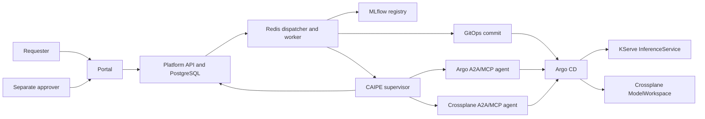

# AI Platform Lab

A local, GitOps-managed AI/ML deployment platform. A requester selects an
immutable model version in the self-service portal, a different user approves
it, and the control plane publishes Kubernetes desired state to Git. Argo CD
reconciles a KServe release and a Crossplane workspace. The portal shows the
request, audit trail, and observed deployment state.

The authoritative checkout is `/home/lateef/ai-platform-lab` in Ubuntu WSL.
The deployment runs on a three-node KIND cluster on one Windows machine. The
`*.ai-platform.local` addresses below resolve only on that machine.

## Current scope

- **Control plane:** portal and FastAPI API, PostgreSQL, Redis dispatcher and
  worker, Keycloak OIDC login with PKCE, tenant-aware authorization, and
  separate requester/approver identities.
- **Model path:** MLflow registry with MinIO artifacts, a trained tax document
  classifier, GitOps release manifests, KServe inference, and a Crossplane
  `ModelWorkspace` backed by a local PVC and initializer Job.
- **Reconciliation:** Argo CD root and child Applications manage platform,
  security, ML, monitoring, and environment resources.
- **Agent observation:** the worker and dispatcher use a CAIPE supervisor.
  Purpose-specific Argo and Crossplane agents expose authenticated A2A v1
  JSON-RPC tasks and invoke scoped MCP tools to read the real Argo CD API.
- **Operations:** nginx ingress, cert-manager private CA, Prometheus, Grafana,
  Loki, and Tempo. Request IDs correlate audit records and logs.

Development and staging releases have completed the request-to-inference path.
The [architecture reflection review](docs/architecture-reflection-review.md) records design decisions, corrections, and production gates. The [acceptance checkpoint](docs/acceptance-progress-2026-09-18.md) records
evidence and remaining gaps. Distributed CAIPE tracing, automated rollback,
and some security and failure-path audits remain open.

## Use cases

| User or team | Use case | Platform outcome |
|---|---|---|
| Data scientist | Package training code from the golden template, register a qualified MLflow version, and request a development or staging deployment | Reproducible model lineage and a governed deployment request |
| ML engineer | Onboard a model application, validate the inference contract, and deploy an immutable registered version | KServe serving resources generated without hand-written workload YAML |
| Approver | Review the model, tenant, version, environment, and reason before release | Separation of duties with an auditable approval decision |
| Platform engineer | Review catalog entries, shared runtimes, identities, policies, and environment configuration | Standardized deployments with centralized guardrails |
| SRE or operator | Inspect reconciliation, readiness, metrics, logs, and correlated request events | A single operational view across API, Argo CD, Crossplane, and KServe |
| Auditor | Trace requester, approver, immutable lineage, Git revision, and runtime state | Evidence from request creation through serving readiness |

Typical applications include document classification, fraud scoring, risk
models, forecasting, recommendation, and other MLflow-compatible models that
serve the KServe V2 inference protocol. The current lab enables development
and staging. Production remains gated until promotion and rollback controls
are fully verified.

## Platform functions

| Function | What it does |
|---|---|
| Golden project scaffolding | Creates a model repository skeleton with a training contract, pinned starter dependencies, lineage test, and catalog entry template |
| Declarative model catalog | Defines the model name, display metadata, MLflow format, KServe runtime, storage identity, service account, and enabled environments |
| Identity and role enforcement | Authenticates with Keycloak and authorizes data scientists, ML engineers, approvers, viewers, and platform administrators |
| Tenant isolation | Limits normal users to their tenant and carries the tenant identity into request and runtime metadata |
| Deployment request workflow | Creates, submits, approves, rejects, lists, and audits immutable model deployment requests |
| Separation of duties | Prevents a requester from approving their own deployment |
| Registry and lineage validation | Resolves a numeric MLflow version and validates Ready status, immutable model ID, run ID, source commit, dataset version, artifact URI, and model metric |
| GitOps generation | Produces tenant-scoped KServe, NetworkPolicy, Crossplane workspace, Kustomize, and Argo CD resources |
| Automated reconciliation | Uses Argo CD to apply and self-heal desired state from the main branch |
| Infrastructure provisioning | Uses Crossplane to create and report the request-linked model workspace and storage state |
| Serving | Deploys the registered model through KServe and the V2 inference protocol |
| Agent-based observation | Uses scoped A2A and MCP agents to read Argo CD and Crossplane state without giving workers broad cluster credentials |
| Status and audit | Returns policy, execution, Argo, Crossplane, and request event details to the portal and API |
| Observability | Exposes Prometheus metrics, Grafana dashboards, Loki logs, and request correlation for operations |
| Secure ingress and TLS | Publishes local HTTPS routes through nginx and certificates issued by the local cert-manager CA |
| CI validation | Renders Kustomizations, tests services, validates the model catalog, rejects inline secret payloads, and checks repository hygiene |

## Local URLs and access

Windows hosts entries map these names to `127.0.0.1`. Windows ports 80 and
443 forward to WSL ports 18088 and 18443, which forward to the shared ingress.
The local CA is trusted in Windows. These URLs are not public.

| Service | URL | Access |
|---|---|---|
| Self-service portal | <https://api.ai-platform.local/portal/> | Keycloak demo requester or approver |
| Platform API | <https://api.ai-platform.local/> | Public health endpoint; bearer token for protected endpoints |
| Argo CD | <https://argocd.ai-platform.local/> | Argo CD administrator |
| Keycloak | <https://keycloak.ai-platform.local/> | Identity service |
| Keycloak admin console | <https://keycloak.ai-platform.local/admin/master/console/> | Keycloak administrator |
| MLflow | <https://mlflow.ai-platform.local/> | Local lab UI |
| Grafana | <https://grafana.ai-platform.local/> | Grafana administrator |
| Prometheus | <https://prometheus.ai-platform.local/> | Local lab UI |
| Tax classifier | <https://tax-classifier.ai-platform.local/> | KServe inference API, not a login page |

The demo accounts are `demo-requester` (data scientist), `demo-ml-engineer` (ML engineer), and `demo-approver`. Their passwords
are stored outside Git at
`C:\Users\user\Downloads\ai-platform-demo-credentials.txt`. Argo CD,
Grafana, and Keycloak administrator credentials are stored in their respective
Kubernetes bootstrap Secrets. Never copy them into this repository. See the
[demo runbook](docs/demo-runbook.md) for the sign-in and approval sequence.

## Onboard a new model application

Use the reusable MLflow/KServe template instead of copying an existing
service:

    python3 scripts/scaffold_model.py fraud-risk-model \
      --display-name "Fraud risk model" \
      --description "Scores transactions for fraud review" \
      --owner tax-ml-team

Implement and test the generated training contract, register a Ready numeric
version in MLflow, and add its generated catalog entry to
platform/model-catalog.json. The portal reads that catalog and the worker
uses its runtime, storage, and service-account settings when producing
GitOps resources. See docs/model-application-golden-path.md.

## Worked data scientist example

The repository includes a complete fictional tax-transaction example in
`services/mock-avalara-tax-category-classifier`. It generates privacy-safe
synthetic data, trains and evaluates a scikit-learn pipeline, enforces the
catalog quality threshold, and registers the model in MLflow. Follow the
[Mock Avalara data scientist walkthrough](docs/mock-avalara-data-scientist-walkthrough.md)
for detailed commands from dataset creation through portal deployment.

The example is not an Avalara product and is not suitable for tax advice,
compliance decisions, or production filing.

## Request-to-deployment flow



1. Sign in as `demo-requester` or `demo-ml-engineer` and create a request for
   `tax-document-classifier`, immutable version `1`, in `dev` or
   `staging`.
2. Submit it. Sign out, then sign in as `demo-approver` and approve with a
   reason. The API rejects self-approval.
3. The worker resolves the registered model and commits the KServe release
   and request-linked workspace to Git. Argo CD reconciles them.
4. The agents read Argo and Crossplane state through scoped, authenticated
   tools. Refresh the portal to see status and audit events.
5. Confirm the serving Application is Synced/Healthy and the
   InferenceService is Ready before treating the model as serving.

Read the [portal guide](docs/self-service-portal.md),
[CAIPE design](docs/caipe-architecture.md),
[Argo observer](docs/argo-api-integration.md), and
[Crossplane guide](docs/crossplane-local.md) for component details.

The [local administrator guide](docs/local-admin-access.md) documents the
separate sign-in stores and credential recovery boundaries.

## Repository map

| Path | Purpose |
|---|---|
| `infra/kind/` | KIND cluster configuration |
| `infra/terraform/`, `automation/ansible/` | Infrastructure and host automation |
| `gitops/argocd/` | Root Application, projects, and child Applications |
| `gitops/platform/`, `gitops/platform-edge/` | Control plane and HTTPS routes |
| `gitops/platform-infrastructure/` | Argo, cert-manager, PKI, Crossplane, and KServe |
| `gitops/ml-platform/`, `gitops/security/` | Registry, serving, and identity |
| `services/platform-api/` | Portal, authentication, API, persistence, and audit |
| `services/deployment-worker/` | Dispatcher, release writer, and CAIPE supervisor |
| `services/caipe-agent/` | A2A agents and MCP tools |
| `services/tax-document-classifier/` | Training and inference implementation |
| `observability/` | Monitoring configuration |
| `scripts/`, `docs/` | Bootstrap, validation, runbooks, and evidence |

## Operate the existing deployment

Run Kubernetes commands from the authoritative Ubuntu WSL checkout:

```bash
cd /home/lateef/ai-platform-lab
kubectl config current-context
kubectl get nodes
kubectl get applications.argoproj.io -n argocd
kubectl get pods -A --field-selector=status.phase!=Running,status.phase!=Succeeded
kubectl get inferenceservice -n ml-platform
```

The expected context is `kind-ai-platform`. Applications should be
Synced/Healthy and the relevant InferenceService should be Ready. A
`No resources found` result from the non-running-pod query is normal.

The shared WSL ingress forward is a runtime process. If browser URLs stop
responding after WSL or Windows restarts, inspect it and restart if absent:

```bash
ss -ltnp | grep -E ':(18088|18443) '
nohup kubectl -n ingress-nginx port-forward --address 0.0.0.0 \
  service/ingress-nginx-controller 18088:80 18443:443 \
  >/tmp/ai-platform-ingress-forward.log 2>&1 </dev/null &
```

On Windows, `netsh interface portproxy show v4tov4` should show
`127.0.0.1:80 -> 127.0.0.1:18088` and
`127.0.0.1:443 -> 127.0.0.1:18443`. Do not start a second forward if
the ports already listen. For this private CA, Windows
`curl.exe --ssl-no-revoke` verifies the chain and hostname without a
revocation check; the CA does not publish revocation data.

A fresh machine needs Windows/WSL tooling, Docker, KIND, kubectl, Helm, the
trusted local CA, hosts entries, bootstrap Secrets, and the GitOps root
Application. This repository has manifests and runbooks, but no one-command
clean-room installer. See `infra/`, `gitops/argocd/root-app.yaml`, and
the component guides before recreating the cluster. Keep bootstrap
credentials, Argo tokens, and the CA private key out of Git.

## Development and changes

Create a feature branch from `main`. Render affected Kustomizations, run
relevant service tests, and open a pull request. The
[GitOps validation workflow](.github/workflows/gitops-validate.yaml) checks
Kustomize rendering, YAML, secret payloads, private keys, whitespace, and
applicable service tests. Merge after checks pass; Argo CD reconciles
`main`. Validate the live resource and update the acceptance evidence.

```bash
git status --short --branch
kubectl kustomize gitops/platform-edge >/dev/null
git diff --check
```

The [2026-09-18 acceptance report](docs/acceptance-progress-2026-09-18.md)
is the current verification snapshot. The older
[requirements matrix](docs/requirements-matrix.md) and
[platform audit](docs/platform-audit.md) are historical checkpoints.
