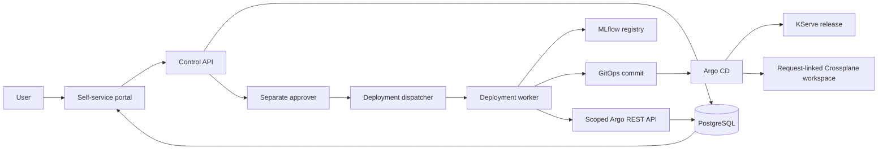

# AI Platform Lab

Local enterprise AI/ML deployment control plane on Windows 10, WSL2,
KIND, Kubernetes, Argo CD, Keycloak, MLflow, KServe, Crossplane, and
Prometheus/Grafana. The authoritative repository lives at
`/home/lateef/ai-platform-lab` in Ubuntu WSL.

The platform is operational, but the full agentic control-plane design
is still in progress. See the
[acceptance report](docs/acceptance-progress-2026-09-18.md) for verified
results and open requirements.

## Deployment flow

The Argo observer uses a read-only local account and trusted internal
TLS. Approved KServe releases include a request-linked Crossplane
workspace. Its local Composition provisions a PVC and initializer Job.
The dispatcher observes its Ready status through the scoped Argo API.
A CAIPE supervisor, A2A wire protocol, MCP tools, and rollback flow remain open.

## Local URLs

All names resolve to `127.0.0.1` on Windows through the single ingress
bridge. The local CA is trusted in Windows; `curl.exe --ssl-no-revoke`
is used for this private CA because it does not publish revocation data.

| Service | URL |
|---|---|
| Self-service portal and control API | https://api.ai-platform.local/portal/ |
| Inference API | https://api.ai-platform.local/ |
| Argo CD | https://argocd.ai-platform.local/ |
| Keycloak | https://keycloak.ai-platform.local/ |
| MLflow | https://mlflow.ai-platform.local/ |
| Grafana | https://grafana.ai-platform.local/ |
| Prometheus | https://prometheus.ai-platform.local/ |
| Tax classifier | https://tax-classifier.ai-platform.local/ |

The shared WSL ingress forwards use ports `18088` and `18443`;
Windows portproxy maps ports `80` and `443` to them. Do not add a
per-service forward for normal operation.

## Change workflow

1. Create a `codex/` feature branch from `main`.
2. Render affected Kustomizations and run relevant Python tests.
3. Open a PR. CI checks GitOps YAML, secrets, whitespace, and service tests.
4. Merge after CI passes. Argo reconciles the Git state.
5. Validate the live service and record evidence in the acceptance report.

Use GitOps for durable Kubernetes settings. Existing bootstrap credentials
and the local CA private key stay outside Git. See
[the Argo API integration](docs/argo-api-integration.md),
[the portal](docs/self-service-portal.md),
[Crossplane local design](docs/crossplane-local.md), and
[the demo runbook](docs/demo-runbook.md).
