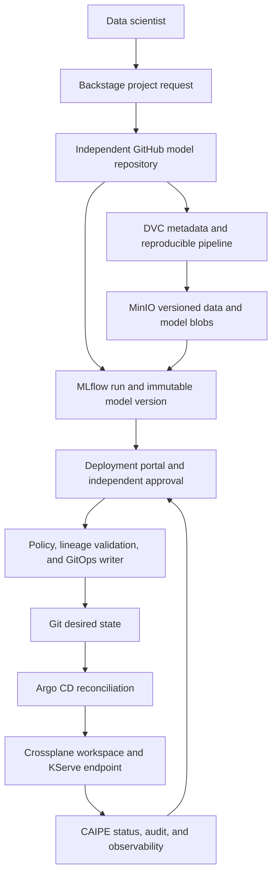

# Five-minute AI platform interview demo

This guide turns the September 19, 2026 work into one coherent interview
story. It supports a live KIND-cluster walkthrough and an offline evidence
walkthrough. Both tell the same story and use the same architecture.

The example is fictional. It uses synthetic transaction records and simplified
labels to demonstrate platform engineering, not Avalara products, tax rules,
tax advice, or production filing.

## Executive message

> I built a self-service AI platform that separates model development from
> model deployment. Backstage gives data scientists a governed repository;
> DVC and MinIO make datasets and model outputs reproducible; MLflow registers
> an immutable qualified model version; and an approval-driven control plane
> writes GitOps desired state. Argo CD, Crossplane, and KServe reconcile that
> state while the portal exposes status and audit evidence.

The business problem is that data scientists should not need to hand-build
Kubernetes, storage, identity, or deployment pipelines for every model. The
platform provides a paved road while retaining quality gates, separation of
duties, immutable lineage, tenant boundaries, and operational evidence.

## Architecture in one view



There are two related but deliberately separate workflows:

| Workflow | Starts with | Ends with | Control boundary |
|---|---|---|---|
| Model development | Backstage project request | Qualified numeric MLflow version | Data scientist owns model code and experiments in an independent repository |
| Model deployment | Portal request | Ready KServe endpoint with audit evidence | Platform owns approval, policy, GitOps, infrastructure, and runtime state |

Backstage does not deploy a model. MinIO is not the registry. MLflow does not
authorize a release. Each tool has one clear responsibility.

## What changed on September 19

Reviewing the non-merge commits shows the platform evolving in four steps:

| Commit | Change | Why it matters to the story |
|---|---|---|
| `a8957e5` | Added the synthetic Avalara-aligned classifier and training walkthrough | Supplied a safe, explainable business example and a measurable quality gate |
| `990e447` | Moved model development into an independent repository and added the DVC golden path | Established the boundary between application ownership and platform ownership |
| `335fa5f` | Added Backstage project requests and MinIO-backed DVC storage | Turned a manual template into a self-service, repeatable onboarding path |
| `03ec581` | Aligned the walkthrough with the live Backstage and MinIO endpoints | Connected the documentation to the deployed lab and fresh-clone recovery path |

The merge commits `00dcf18` and `7d10e7b` brought those changes to `main`.
The resulting narrative is: **request, reproduce, qualify, approve, reconcile,
serve, and observe**.

## Five-minute talk track

### 0:00-0:40 — Problem and outcome

Show this page and the architecture diagram.

Say:

> The problem was not simply deploying one classifier. It was giving data
> scientists a repeatable path from a new idea to a governed endpoint without
> granting them broad cluster access or forcing the platform team to write
> custom YAML for every model. I split the system into a development path and
> a deployment control plane, then connected them through immutable lineage.

### 0:40-1:20 — Self-service project creation

Live: open `https://backstage.127.0.0.1.nip.io/create` and show **Create an ML
project**. Do not create a repository during the five-minute demo; show the
fields and explain the generated result.

Offline: show `docs/backstage-project-requests.md`,
`templates/mlflow-kserve-model/`, and `.dvc/config` in the template.

Say:

> Backstage is the front door. It creates a private, independent model
> repository from a controlled golden template and registers the component.
> The generated project includes tests, a DVC pipeline, pinned dependencies,
> lineage fields, and a proposed platform catalog entry. Server-side policy
> fixes the GitHub owner and visibility instead of trusting user input.

### 1:20-2:05 — Reproducible data and training

Live: show the model repository's `dvc.yaml`, `dvc.lock`, `params.yaml`, and
`reports/metrics.json`. If useful, run `dvc metrics show`; do not retrain during
the timed demo.

Offline: show the same files in the golden template and the sample walkthrough.

Say:

> Git stores source, parameters, hashes, and small metrics. DVC tracks the
> pipeline and content identity. Large datasets and model outputs live under a
> team- and project-scoped prefix in the versioned MinIO bucket. A teammate can
> clone the repository and use `dvc pull` to recover the exact artifacts. The
> synthetic sample is deterministic, and CI can reproduce it without private
> data access.

### 2:05-2:45 — Qualification and immutable lineage

Live: open `https://mlflow.ai-platform.local/` and show the registered model,
numeric version, macro-F1, source commit, dataset version, dataset hash, and DVC
lock hash.

Offline: show `templates/mlflow-kserve-model/src/train.py` and point to the
same lineage tags and quality threshold.

Say:

> Training must pass the catalog's macro-F1 threshold before registration.
> MLflow records the experiment and produces a numeric model version tied to
> the source commit and DVC/data hashes. The deployment workflow accepts that
> immutable version, not a mutable stage name such as latest.

Do not present the perfect score from the synthetic data as model quality. It
only proves that the pipeline, contract, and gates work.

### 2:45-3:40 — Governed deployment

Live: open `https://api.ai-platform.local/portal/`. Show a request made by
`demo-requester` or `demo-ml-engineer`, followed by approval from the separate
`demo-approver` identity. Prefer an existing successful request so the demo is
deterministic.

Offline: show `docs/acceptance-progress-2026-09-18.md` and the recorded request
IDs, denial of self-approval, Git commit, Argo state, Crossplane state, and
audit events.

Say:

> Repository creation and deployment are intentionally separate. The requester
> selects a cataloged model, positive numeric version, tenant, and supported
> environment. Self-approval returns 403. After an independent approval, the
> worker validates registry state and lineage, writes request-specific desired
> state to Git, and preserves the decision and reason in the audit trail.

### 3:40-4:30 — Reconciliation and serving

Live: show the release Application in Argo CD as `Synced/Healthy`, the
request-linked Crossplane `ModelWorkspace` as Ready, and the KServe
`InferenceService` as Ready. Use the portal's observed status rather than
starting a new rollout.

Offline: show an existing release under `gitops/ml-platform/releases/` and the
acceptance evidence.

Say:

> Git is the deployment API between the control plane and the cluster. Argo CD
> continuously reconciles desired state. Crossplane creates the request-linked
> workspace and storage, while KServe exposes the model through the V2
> inference contract. Purpose-specific CAIPE agents observe Argo and Crossplane
> through scoped A2A and MCP interfaces and return status to the portal without
> giving the worker broad cluster credentials.

### 4:30-5:00 — Reliability judgment

Say:

> The strongest engineering choice is the chain of evidence: repository
> commit, DVC lock, dataset hash, MLflow model version, approval identity,
> GitOps revision, and observed runtime state. I also keep the boundaries
> honest: this is a local KIND implementation with synthetic data; production
> remains gated until rollback, stronger per-project credentials, high
> availability, disaster recovery, and complete distributed tracing are
> verified.

End with:

> The result is a paved road that increases data-scientist autonomy while
> reducing deployment variance and preserving SRE-grade control.

## Live-cluster route

### Before the interview

Use the authoritative WSL checkout and confirm the existing shared ingress.
Do not start duplicate port-forwards.

```bash
cd /home/lateef/ai-platform-lab
git status --short --branch
kubectl config current-context
kubectl get nodes
kubectl get applications.argoproj.io -n argocd
kubectl get inferenceservice -A
kubectl get modelworkspaces -A
kubectl get pods -A --field-selector=status.phase!=Running,status.phase!=Succeeded
```

Expected results:

- context is `kind-ai-platform`
- three KIND nodes are Ready
- relevant Argo Applications are Synced and Healthy
- the selected InferenceService and ModelWorkspace are Ready
- the final pod query returns no unexpected resources

Open these tabs in order:

1. This architecture page.
2. Backstage create page.
3. The independent sample model repository.
4. MLflow registered model version.
5. Deployment portal with an existing successful request.
6. Argo CD release Application.

Keep the credentials file outside Git. Never display passwords, access keys,
tokens, Secret values, or `.dvc/config.local` while screen sharing.

### Safe live actions

The five-minute demo should be observational. Showing a template, metrics,
registered model version, existing approved request, and reconciled runtime is
enough to prove the path. Creating a repository, retraining, pushing DVC data,
or starting a new deployment introduces avoidable network and reconciliation
latency. Reserve those actions for a longer technical follow-up.

If a browser URL is unavailable, switch immediately to the offline route. Do
not spend interview time repairing the lab.

## Offline fallback route

The fallback demonstrates the implemented contracts and recorded evidence; it
must not be described as a live deployment.

Use these files in order:

| Evidence | What to point out |
|---|---|
| `docs/backstage-project-requests.md` | Request policy, private repo creation, recovery behavior, and responsibility boundaries |
| `templates/mlflow-kserve-model/` | The generated project contract rather than a copied one-off service |
| `templates/mlflow-kserve-model/dvc.yaml` and `.dvc/config` | Reproducible stages and the project-scoped MinIO remote |
| `templates/mlflow-kserve-model/src/train.py` | Quality gate and immutable MLflow/DVC/source lineage |
| `platform/model-catalog.json` | Central runtime, identity, environment, ownership, and threshold policy |
| `docs/acceptance-progress-2026-09-18.md` | Recorded identity, approval, Argo, Crossplane, KServe, inference, and audit evidence |
| `gitops/ml-platform/releases/` | Concrete desired state generated for accepted requests |

Show the September 19 evolution locally with:

```bash
git log --since=2026-09-19 --until=2026-09-20 --oneline
git show --stat a8957e5
git show --stat 990e447
git show --stat 335fa5f
git show --stat 03ec581
```

Use precise language:

- **Implemented:** present in source, manifests, templates, or tests.
- **Verified:** backed by the dated acceptance evidence or the September 19
  fresh-clone/MinIO verification recorded in the walkthrough.
- **Designed:** documented but not yet exercised end to end.
- **Production gate:** intentionally incomplete and not claimed as production
  ready.

## Interview questions to expect

### Why both DVC and MLflow?

DVC reproduces the data and pipeline outputs from Git-addressable metadata;
MinIO stores the large content-addressed blobs. MLflow tracks experiments,
metrics, model packaging, and registered immutable versions. The integration
links an MLflow version to the source commit, dataset hash, and DVC lock hash.

### Why Backstage and a separate deployment portal?

They govern different lifecycle events. Backstage provisions a standardized
development repository. The deployment portal applies release policy,
separation of duties, audit, and environment controls to an already-qualified
model. Combining them would blur ownership and authorization boundaries.

### Why GitOps instead of calling Kubernetes directly?

Git supplies reviewable desired state, an immutable change record, drift
correction, and a clean boundary between the control plane and cluster. Argo CD
owns reconciliation, so transient worker failures do not change the declared
release intent.

### What happens if MinIO is unavailable?

New `dvc push`/`pull` operations and artifact-dependent training or loading
fail, but Git metadata remains intact. The operator restores MinIO and its
persistent data, then retries using the same DVC hashes. Production would add
replication, backup/restore testing, alerts, and an explicit recovery objective.

### What would you change for production?

Replace local KIND and shared lab integrations with highly available managed
or hardened services; use workload identity and per-project credentials;
externalize secret management; add admission policy, signed artifacts, and
software supply-chain controls; verify automated rollback, backups, restore,
capacity, SLOs, and failure tests; and complete trace correlation across the
control and data planes.

## STAR summary

**Situation:** Data scientists had model code and experiments, but no uniform,
governed route to a Kubernetes endpoint.

**Task:** Provide self-service onboarding and deployment without sacrificing
lineage, separation of duties, tenant policy, or operational visibility.

**Action:** Introduced a Backstage golden path, independent model repositories,
DVC with project-scoped MinIO storage, MLflow quality and lineage contracts,
catalog-driven deployment requests, independent approval, GitOps generation,
Argo/Crossplane/KServe reconciliation, and scoped CAIPE observation.

**Result:** Demonstrated reproducible project recovery and a traceable route
from a qualified model version to Synced/Healthy desired state, Ready workspace
and serving resources, inference checks, and correlated audit evidence. Avoid
inventing business-impact numbers; describe these as technical acceptance
results unless measured organizational outcomes exist.

## Source guides

- [Backstage project requests](backstage-project-requests.md)
- [Mock Avalara data scientist workflow](mock-avalara-data-scientist-walkthrough.md)
- [Local deployment demo](demo-runbook.md)
- [Model application golden path](model-application-golden-path.md)
- [Acceptance evidence](acceptance-progress-2026-09-18.md)
- [Architecture reflection and production gates](architecture-reflection-review.md)

